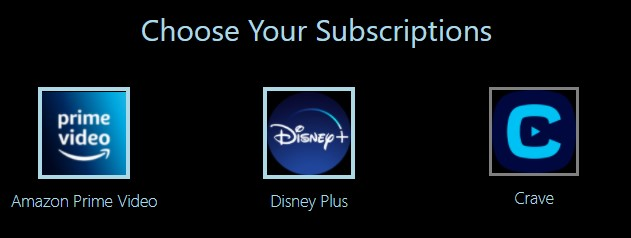
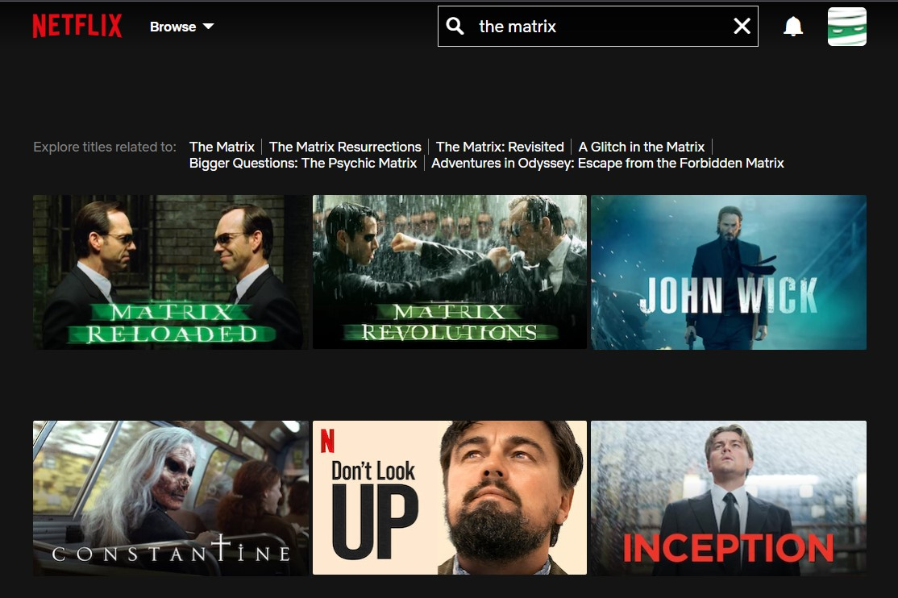
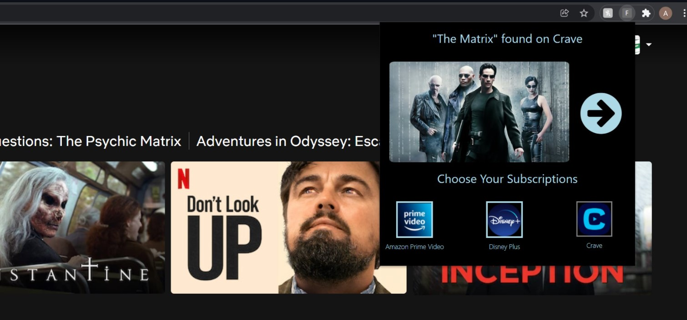

# FlixStream
FlixStream is a chrome extension that checks your other streaming subscriptions for movies / tv shows if they cannot be found on Netflix using the TMDB API.

# Demo

1\) Select your subscription sites

2\) Search your movie on Netflix

3\) If you movie is not available on Netflix, open the popup window to check if it is available on your other streaming sites

