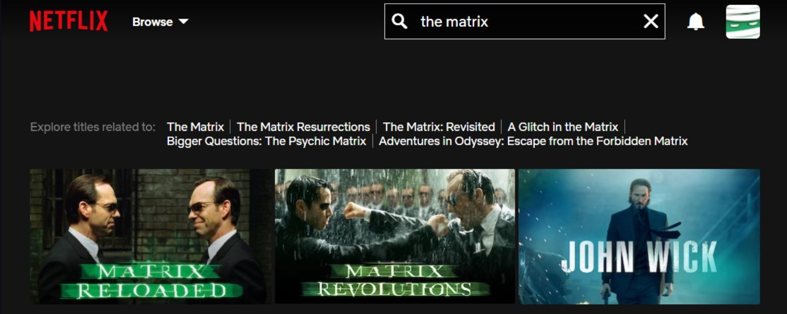

# FlixStream
FlixStream is a chrome extension that uses the TMDB API to check your other streaming subscriptions for movies / tv shows if they cannot be found on Netflix.

# Demo

1\) Select your subscription sites

2\) Search for your movie on Netflix

3\) If your movie is not available on Netflix, open the popup window to check if it is available on your other sites

4\) Click on the blue arrow to take you to your movie

# To-Do

1) Justwatch API for deep links
2) Add feature where it notifies user of movie that they searched when it becomes available (backend)
3) Rework UI
